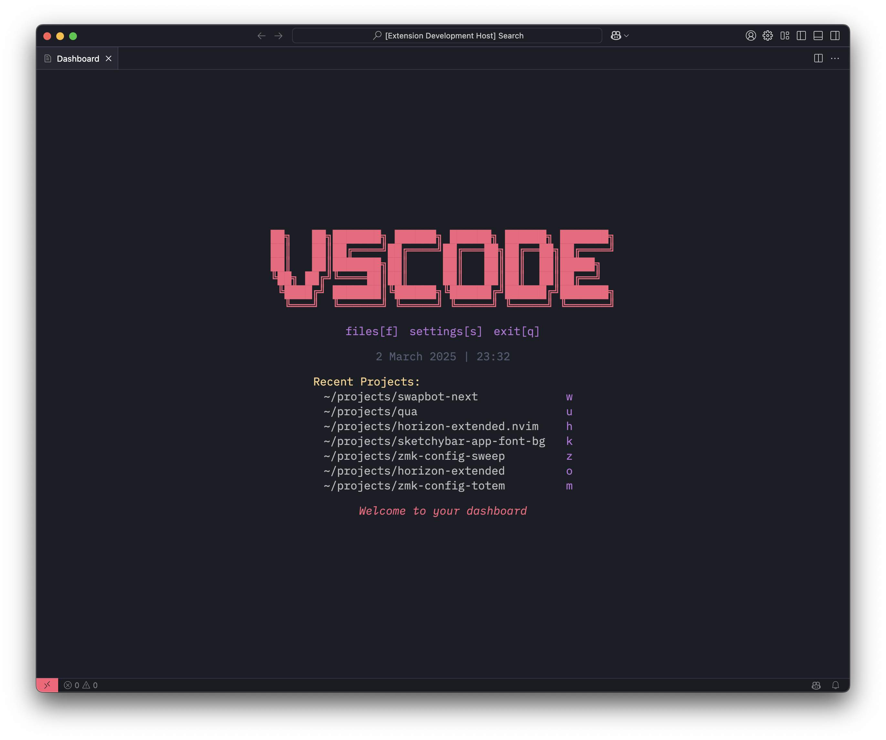

<h1 align='center'>Nvim Dashboard for VS Code</h1>

A simple text based dashboard for VS Code inspired by [Nvim Dashboard](https://github.com/nvimdev/dashboard-nvim)

## Features

- Customizable hotkeys
- Customizable ascii art logo
- Customizable bottom message

## Usage

Adjust the settings to add your own hotkeys, logo, and messages. This may require some knowledge of the [VS Code API](https://code.visualstudio.com/api) and how to modify your settings JSON file.

## Plans

- [x] Recent projects
- [x] Customizable hotkeys
- [x] Customizable ascii art logo
- [x] Customizable bottom message
- [ ] Color customization
- [ ] Additional themes
- [ ] Recent files
- [ ] Add more themes

## Credits

- [Nvim Dashboard](https://github.com/nvimdev/dashboard-nvim)
- [Big Welcome](https://github.com/ArmanDris/big-welcome/tree/master)
- [VS Code: KeybindingMode](https://github.com/kubenstein/keybinding-mode/tree/master)
